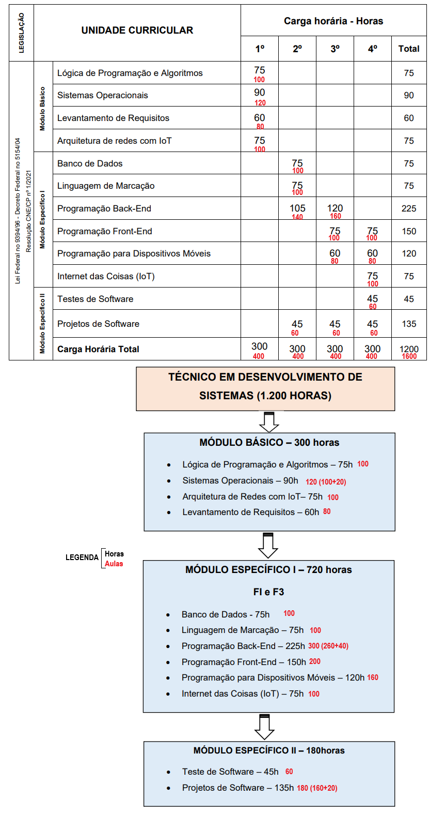

# Técnico em Desenvolvimento de Sistemas

## 5º Itinerário: Formação Técnica e Profissional

Este repositório contém os projetos e atividades desenvolvidos durante o curso de **Técnico em Desenvolvimento de Sistemas**. Esta formação é parte do 5º Itinerário de Formação Técnica e Profissional, uma parceria entre o **SESI (Serviço Social da Indústria)** e o **SENAI (Serviço Nacional de Aprendizagem Industrial)**.

---

### **Estrutura Curricular**

O curso está dividido em quatro semestres, com foco no desenvolvimento de competências essenciais para o mercado de trabalho de tecnologia.

#### **1º Semestre**
* **Lógica de Programação e Algoritmos**: `75/100`
* **Sistemas Operacionais**: `90/120`
* **Levantamento de Requisitos**: `60/80`
* **Arquitetura de Redes com IoT**: `75/100`

---

#### **2º Semestre**
* **Bancos de Dados**: `75/100`
* **Linguagem de Marcação**: `75/100`
* **Programação Back-End 1**: `105/140`
* **Projetos de Software**: `45/60`

---

#### **3º Semestre**
* **Programação Front-End 1**: `75/100`
* **Programação Back-End 2**: `120/160`
* **Programação Para Dispositivos Móveis**: `60/80`
* **Projetos de Software 02**: `45/60`

---

#### **4º Semestre**
* **Internet das Coisas (IoT)**: `75/100`
* **Programação Front-End 2**: `75/100`
* **Programação Para Dispositivos Móveis**: `60/80`
* **Testes de Software**: `45/60`
* **Projetos de Software 03**: `45/60`

---

### **Destaque do Plano de Curso**

O plano de curso é projetado para oferecer uma base sólida em desenvolvimento de software, desde a lógica de programação até as tecnologias mais atuais, como **Internet das Coisas** e desenvolvimento **mobile**, com forte ênfase na aplicação prática através de múltiplos projetos.
